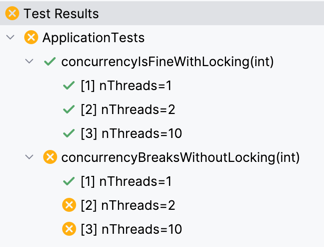

## Context

Demonstrates the use of Spring Data JPA with [Jakarta Persistence locking](https://jakarta.ee/learn/docs/jakartaee-tutorial/current/persist/persistence-locking/persistence-locking.html) with pessimistic write locks.

It implements the classic and naive bank account balance scenario to simulate the case of

1. Retrieving an account entity
2. Adding a deposit amount to the account's balance
3. Saving the entity back to the database

There are two parts to correctly handling the locking of the entities to increment:

[The service method](src/main/java/me/itzg/app/AccountService.java) is wrapped in a transaction scope:

```java
@Transactional
public Account deposit(long id, BigDecimal amount) {
    final Account account = accountRepository.findAccountById(id).orElseThrow();
    account.setBalance(
        account.getBalance()
            .add(amount)
    );
    return accountRepository.save(account);
}
```

_The code snippet here is simplified for clarity. The actual deposit method accepts a `boolean useLock` to exercise test scenarios._

...and [the repository](src/main/java/me/itzg/app/db/AccountRepository.java) method is designated as the pessimistic-write lock:

```java
public interface AccountRepository extends CrudRepository<Account, Long> {
    
    @Lock(LockModeType.PESSIMISTIC_WRITE)
    Optional<Account> findAccountById(long id);
}
```

## Running tests

The unit tests in `me.itzg.app.ApplicationTests` run the same scenario with and without using a lock along with 1, 2, and 10 threads. Without the lock and two or more concurrent read-change-write's it demonstrates that the account balance gets corrupted by concurrent changes to the account row.



## Running manually

Run the Spring Boot app in your favorite IDE or

```shell
./gradlew bootRun
```

It uses Spring Boot's [compose support](https://docs.spring.io/spring-boot/reference/features/dev-services.html#features.dev-services.docker-compose), so a MySQL container will be started when the application starts.

## Demo REST calls

Create an account

```http request
POST http://localhost:8080/accounts
```

Get an account

```http request
GET http://localhost:8080/accounts/1
```

Submit a deposit

```http request
POST http://localhost:8080/accounts/1/_deposit
Content-Type: application/x-www-form-urlencoded

amount=12.25
```